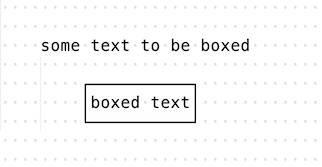
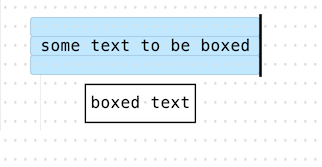
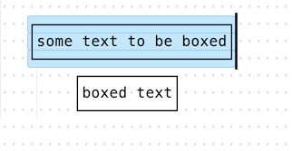
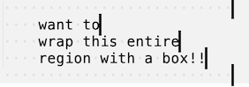
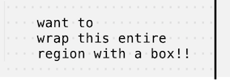
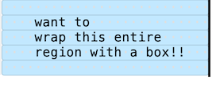
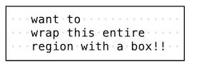

# WrapInBox

WrapInBox is a Sublime Text 3 package that draws a "box" along the edges of your selection region. It uses the [Unicode Box-Drawing Characters](https://en.wikipedia.org/wiki/Box_Drawing_(Unicode_block)) for the borders.

This package comes with four box styles:

    ┌───────┐╭───────╮+-------+┌┈┈┈┈┈┈┐
    │Default││Rounded│| ASCII |┊Dashed┊
    └───────┘╰───────╯+-------+└┈┈┈┈┈┈┘

<br />

## Manual Installation
1. In Sublime Text's menubar, go to ```Preferences ▶ Browse Packages```
1. Drop this repo in the directory that is opened


## Usage
1. Write some text and ensure there's a row above and below, as well as a character to the left and right of it.

    

1. Make a selection surrounding the region you want boxed in. Using your mouse, hold <kbd>alt</kbd> and drag a box to create the region.

    

1. Open the Command Palette using <kbd>control</kbd><kbd>shift</kbd><kbd>p</kbd> (that's <kbd>command</kbd><kbd>shift</kbd><kbd>p</kbd> for Mac users). Select one of the options labeled ```Wrap in Box``` to draw a box within the selection region.

    

## Recommendation
Pair with the [Alignment](https://packagecontrol.io/packages/Alignment) package to quickly set all cursors to the same column:

1. Notice that there are no whitespace characters after the three lines.

     

1. Set cursors at the end of each line by <kbd>alt</kbd> dragging vertically along the right of these lines.

1. Use Alignment to add whitespace so the cursors line up.

    

1. Now you can use this package to draw the box.

    

    
